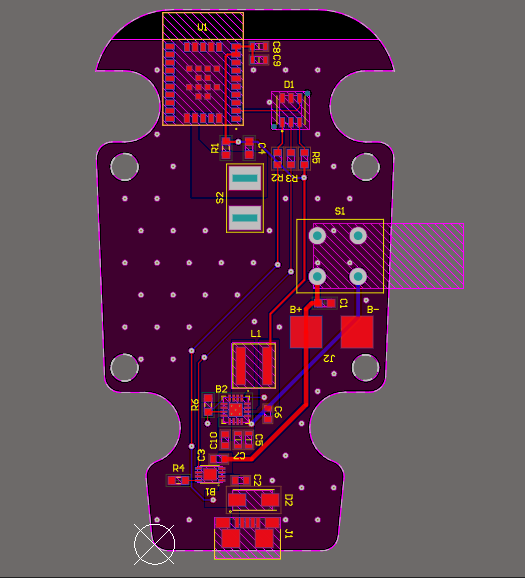
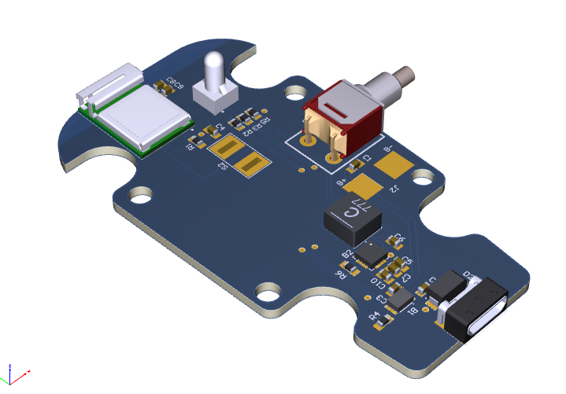
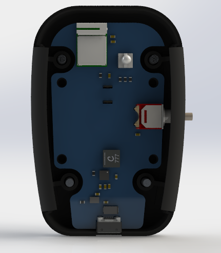
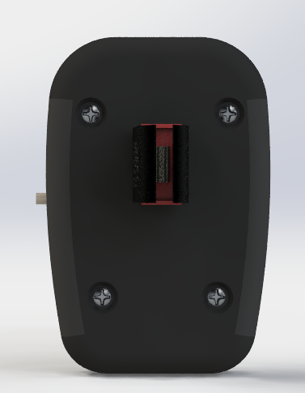
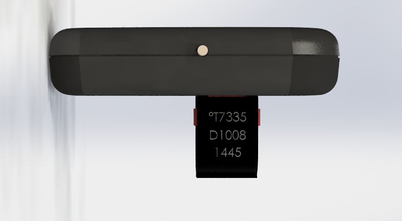

# 🔵 BLE-NTC Pipe Temperature Sensor

A compact, battery-powered wireless temperature sensor using an NTC T7335 thermistor and a NINA-B112 BLE module. Designed to clip onto pipes and transmit real-time temperature data via Bluetooth Low Energy (BLE).

## 📦 Overview

This device is a clamp-on wireless temperature sensor for pipes, built around:

- 📡 **NINA-B112**: u-blox BLE module (based on Nordic nRF52832)
- 🌡️ **NTC T7335**: 10kΩ thermistor for precise surface temperature sensing
- 🔋 Battery-powered for low-power remote monitoring
- ⚙️ Custom PCB designed for mechanical stability and thermal coupling

---

## 🛠️ Features

- Accurate pipe surface temperature monitoring
- BLE GATT server for real-time temperature broadcasting
- Low-power design (sleep/wake modes)
- Compact, clamp-mountable PCB layout
- Thermal paste contact zone for improved temperature accuracy

---

## 🔧 Hardware Specs

| Feature          | Description                                  |
|------------------|----------------------------------------------|
| **Sensor**       | NTC T7335 (10kΩ @ 25°C, B ≈ 3977K)           |
| **BLE Module**   | NINA-B112-00B-00 (internal antenna)          |
| **MCU**          | Nordic nRF52832 (inside NINA-B112)           |
| **Power Supply** | CR2032 coin cell / AA battery / 3.3V ext.    |
| **ADC Interface**| Voltage divider with 10kΩ precision resistor |
| **Mounting**     | Pipe clamp + thermal interface pad/paste     |
| **Firmware**     | BLE custom service with temperature char.    |

---

## 📡 BLE Service Description

**Custom BLE GATT Service: `0x181A` (Environmental Sensing)**  
| Characteristic        | UUID     | Format      | Description                    |
|------------------------|----------|-------------|--------------------------------|
| Temperature            | `0x2A6E` | `int16_t` x100 | Pipe surface temperature in °C |
| Battery Level (opt.)   | `0x2A19` | `uint8_t`   | Battery percentage             |
| Device Info (opt.)     | `0x180A` | -           | Firmware version, model, etc.  |

---

 | 

---

